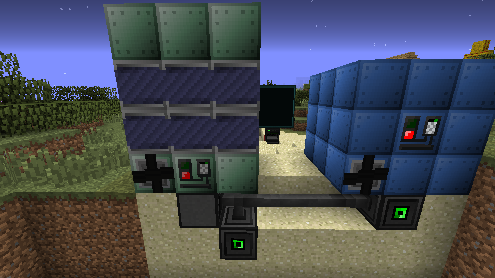
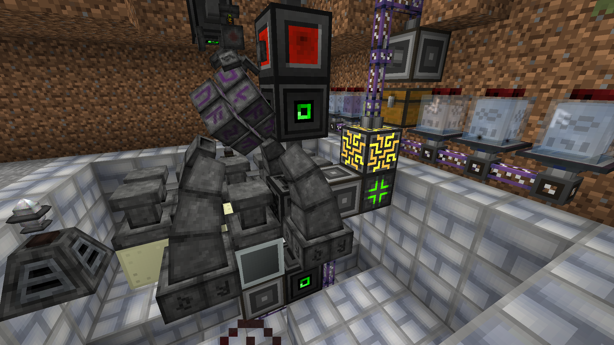

# **NIDAS** - Networked Information Display &amp; Automation Software
    NIDAS runs as a program over the OpenOS shell.

    The program is mostly developed for use with the GregTech: New Horizons modpack.
    It requires OpenGlasses 1, which is only available for 1.7.10.

# **Features**
## **AR HUD (OpenGlasses)**
### **Power monitor**
* Displays current power status: Total capacity, current capacity, input/output rate, and time to full/empty based on the rate.

    (Only works for the Lapotronic Supercapacitor)

### **Toolbar decoration**
* Provides an overlay for the toolbar, displaying both the ingame time and real world time.

### **Notifications**
* Displays a HUD notification of important events, such as machines needing maintenance.

    ! Not implemented in stable !

### **Gregtech machine maintenance overlay**
    Notifies of maintenance need on the HUD and displays an in-world location helper.

## **Machine monitoring**
    As of now, the server tracks machine names, locations, recipe progress, efficiency, power usage, and number of problems.

    Each machine has to be individually configured for location support.

    Local servers can display the data on a connected screen, while the main server provides HUD notifications of maintenace from all local servers.

## **Automated Infusions**
    NIDAS supports auto infusions. It checks for a pattern that maches the items in an ME subnetwork, checks for the required essentia for the infusion and infuses the thing! Pretty handy.

## **Configuration options**
There are many things that can be configured.

### **System configuration**
* Color scheme with support for custom colors. Each of the three colors are configurable.
* Screen resolution.
* Primary screen: Choose which one of the screens connected to the computer is the primary screen.
* Autorun: Choose whether the program should run as soon as the computer boots. There is a `run` button for running it manually.
* Multicasting: Choose whether you want to have all connected screens display the same image.
* Developer mode: Show debug information such as allocated memory.

### **Server configuration**
* Choose if the server is the central server in the system, the one that is connected to the power buffer and controls the glasses.
* Choose which of the connected machines is the power buffer. We will soon suggest a power buffer based on the `sensorInformation` the machines gives us.

### **HUD configuration**
* Name the owner of the glasses.
* Change the rendering resolution.
* Chose GUI scale on the video options of the game: 1 for Small, 2 for Medium, ,3 for Large and 4 for Auto.
* Choose your timezone offset so the real world clock displays your time correctly.
    (If the offset is negative, you must type the number first and then press -, blame @S4mpsa for that)

### **Power configuration**
* Set the redstone component which controls the power.
* Configure the thresholds at which the power generators whould be turned on or off.

# **Requirements**
    Due to the AR glasses requiring tier 3 components, support is only provided for tier 3 components. You can try running it with worse hardware, but don't expect everything to run the way it should.
    Both the local servers and the main server can run on in a T3 computer case, but server racks are suggested for extra component capacity.

## **Components**
* Internet card
    * Important for the installation and update of this program.
    * Is also used on the toolbar overlay to get the current real world time.
* Tier 2 wireless network card
    * Is used for communication between different servers on the system.
* Memory sticks
    * At least one Tier 3.5 or equivalent.
    * We haven't calculated how much we need, but if you can build an OC, you can probably craft plenty of those.
* Component busses
    * Main server does not necessarily need any.
    * Local servers will most likely want these to connect more than a few machines.
    * Each T3 Component bus gives the server 16 more components, with a maximum of around 50 free slots after the required hardware.
    * Aim for the highest tier available.
* HardDisk
    * NIDAS itself uses around 300Kb, so even a T1 Disk should work. We suggest using a T3 disk, however.
* Tier 3 graphics card and screen
    * The configuration menu is very cramped and looks washed out with a T2 screen and GPU.

# **Installation**
    Glad you got this far.
    Let's install this thing.
* Download the `setup` file through the OC shell:
    ```shell
    wget https://raw.githubusercontent.com/S4mpsa/NIDAS/master/setup.lua -f
    ```
* Run `setup` on your machine:
    ```
    setup
    ```

* Enjoy

## **OCEmu**
    So you're a bit of a dev yourself and want to contribute with this project?
    Nice.

    Things are not working perfectly with OCEmu because it's hard to emulate the components. We're open to contributions of any kind, not just regarding OCEmu.


# **Configuration**
    To get things up and running, you'll need to set some things up.
* Server
    * Place the main server first.
        (It could be later, but then you gotta change the setting that says it's the main server on it and on the local server you placed first).
    * Place local servers after the main server has ran at least once.
* Robot
    * The robot is used to get the machine locations for displaying machine maintenance locations.
    * Place it by a charger so it doesn't run out of battery.
    * Create your robot in the electronics assembelr with the following components:
        * Internet card for setting up and updating.
        * Tier 2 network card for communicating with the server.
        * Some RAM.
        * A disk installed with OpenOS
        * A keyboard (Important, don't forget this).
        * A graphics card.
        * A CPU.
        * A Screen
        * Upgrade Container.
        * Navigation Upgrade in the Upgrade Container. (Craft the Navigation Upgrade with a vanilla map that was created on top of the robot to ensure it being in range)
    * Install the program just like you did for the server. You can also install NIDAS to the hard drive before creating the robot.
    * Whenever you place your robot in a new location, it'll prompt you for that location. Use the terminal to give the X, Y and Z coordinates.
* New machines
    * Place down a waypoint so the particle effects are inside the machine controller location.
    * (Optional): Name the waypoint. This will be the name of the machine in the system.
    * (Optional): Give it a redstone signal.
    * Place the adapter on the machine controller (You can use an MFU for that, so you don't need the adapter to be adjacent to the controller).
    * Remove the waypoint after about 5 seconds.
    * This is what it looks like:
    
    Notice the adapter have MFUs on them because they're not adjacent to the machine controllers.
* Glasses
    * Place down a glasses terminal.
    * Bind you glasses to it.
    * Configure the glasses through the configuration screen on the main server.
* Infusion altar
    * Place your altar in the regular way.
    * Place an ME interface with the patterns in a way that when the craft is requested, the first item that goes in is directed to the center pedestal.
    * Place something that can be activated by redstone to start the infusion. (In GTNH, that's the Gadomancy infusion claw).
    * Now for the OC part of it:
        * Place adapters on the runic matrix and on the interface with the patterns.
        * Place a transposer by the center altar and some kind of output inventory adjacent to the transposer.
            * That output should go to the subnetwork so it can finish the craft, then it should go to the main network.
            * Make sure no other inventories are adjacent to the transposer as well.
        * Place a redstone I/O block by the infusion starter.
    * The computer should be connected to an ME subnetwork.
        * The main ME network interfaces with the user. That is: you order the craft from there.
        * The ME subnetwork does the actual crafting and you don't need to interact with it.
        * The items from that craft go into the subnetwork.
            * The ME interface with the pattern from the main network could go to a chest with a storage bus from the subnetwork.
        * The output first goes into the subnetwork first, then into the main network.
            * You could set an output only storage bus from the subnetwork to the ME interface on the main network that configured to the infusion outputs.
    * If you enable developer mode, there will be messages on the computer screen indicating the statuses of the infusions. Expect the pretty GUI to break.
    * This is what it looks like:
    


It's recommended you go through all of the settings after you set things up to get the interfaces to your liking.
