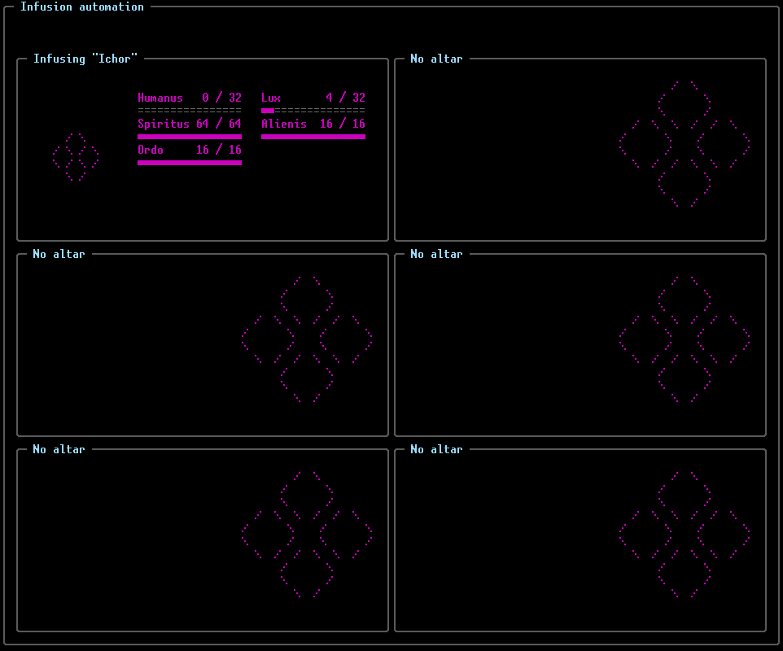
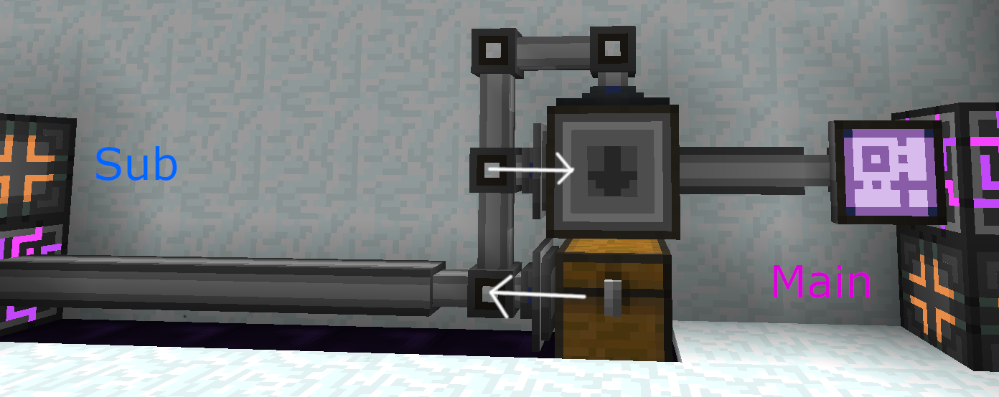
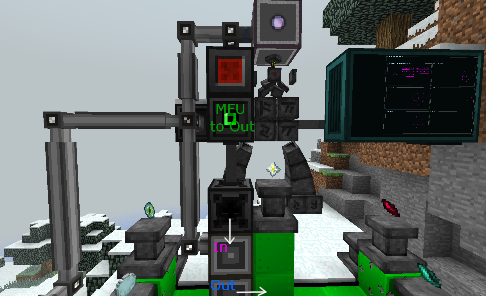

# FEATURES

Currently, there are a few things yet to be implemented and a few other to be fixed, but it does work!

* Allows up to ONE altar per OC currently
* Waits for the essentia to be available before starting the craft
* Nice graphical interface shows you the progress of the ongoing infusion even if you are not well versed in the magical arts

___
___

# SETUP GUIDE

Hi, I see you're interested in auto infusing some stuff.
Let's get right to it.

## AE2 Stuff

First of all, you're gonna make an ME subnetwork. I'm not going to explain this here as there's plenty of material on it online:
* Place an ME Interface with the recipes you want to autocraft pointing to a chest. 
* On the chest, place a storage bus configured to "Extract Only".
* On the interface, place two more storage busses. One for items, set to "Insert Only", and one for essentia.

___

## The altar itself

To get this up and runnning you'll need to set up a TC4 altar with a few attachments. 

You'll need some sort of infusion starter (Gadomancy's Infusion Claw works great, but you could use a robot or whatever)

Some OC parts:
* A Redstone I/O block
* A Transposer
* An Adapter

And some AE2 parts as well: 
* An ME Toggle Bus
* An ME Interface, of course
* Some sort of Infusion Provider (recommended)
  * GTNH has the amazing Infusion Intercepter, which allows for instant essentia transfer between your drives and your matrix.

Place the Thaumcraft altar as usual.
Then place all the other stuff:

* Place the Claw above the runic matrix, so that it will start the infusion on activation. 
  On the **side** of the claw, place the Redstone I/O block. 
  **Above** that I/O block, place the ME Toggle Bus in a way it can toggle the essentia flow to the matrix.
* On the side of the matrix, put the adapter.
* Put the Transposer adjacent to the altar's center pedestal
  And the ME Interface with the desired crafts for the altar just **underneath** the Transposer.

You can use an MFU to connect the adapter wirelessly to the ME Interface or you can use another adapter.

